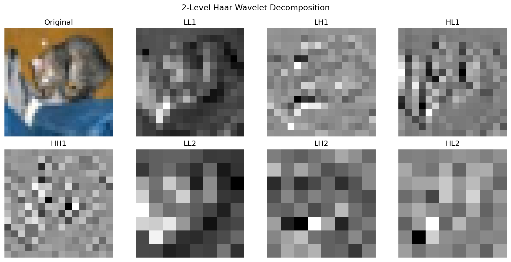
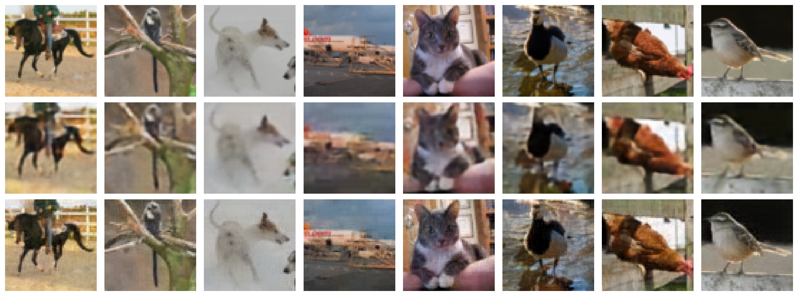
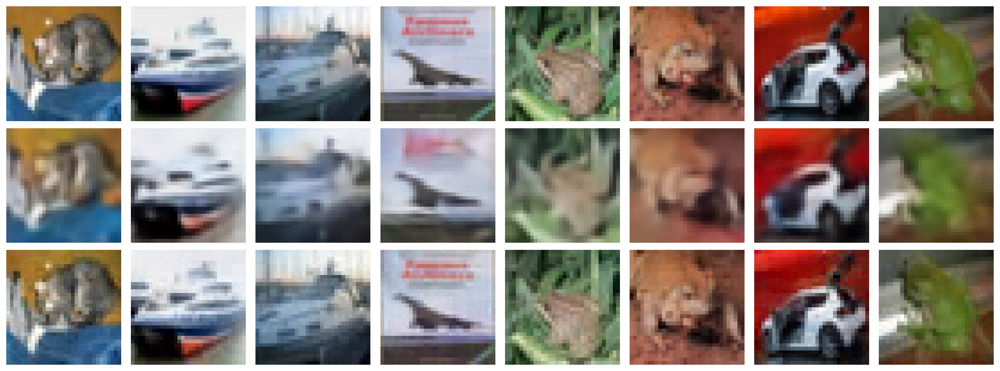

# WVQ: Wavelet Vector Quantization for Image Compression

**Daisuke Yamada (dyamada2@wisc.edu) — CS 766, Spring 2026**

## Motivation

VQ-VAE compresses images by mapping continuous latent features to discrete codebook entries. It's the backbone behind generative models like DALL-E, Parti, and VQ-GAN. The key trade-off is codebook size vs. reconstruction quality — larger codebooks improve fidelity but cost more memory.

Standard VQ-VAE treats all latent features the same, ignoring the known structure of natural images. But from classical signal processing, we know most image energy is concentrated in low frequencies, while edges and textures are sparse. This project asks: can we exploit this structure to build a better VQ-VAE?

## Approach

I decompose images with a 2-level Haar wavelet transform before quantization. This splits the image into 7 subbands — one lowpass (LL2) carrying coarse structure, and six detail subbands capturing edges at different scales and orientations (LH, HL, HH at two levels).

Each subband gets its own encoder, codebook, and decoder. Codebook sizes are allocated based on expected information content:

| Subband | Content | Codebook K |
|---------|---------|-----------|
| LL2 | Lowpass (most energy) | 512 |
| LH1, HL1 | Fine edges | 256 each |
| LH2, HL2 | Coarse edges | 128 each |
| HH1 | Fine diagonal/noise | 64 |
| HH2 | Coarse diagonal/noise | 32 |

The wavelet decomposition is fixed (not learned) and perfectly invertible — no information is lost. After decoding each subband, the inverse DWT reconstructs the full image.


*2-level Haar wavelet decomposition of a CIFAR-10 image. LL2 contains most of the image energy; HH subbands are sparse.*

### Pipeline

1. Image x → 2-level Haar DWT → 7 subbands
2. For each subband: encode → quantize with own codebook → decode
3. Inverse DWT of decoded subbands → reconstructed image

### Training

Standard VQ-VAE loss applied per subband with EMA codebook updates:

L = ||x - x'||^2 + (1/7) * sum_i beta * ||z_i - sg[z_hat_i]||^2

where beta = 0.25 and sg is the stop-gradient operator. Both models trained for 200 epochs with Adam (lr=3e-4).

## Results

### Main comparison (param-equalized, ~920K params each)

All comparisons use parameter-equalized models so the gains come from the wavelet structure, not extra capacity.

| Dataset | Model | MSE | PSNR (dB) | SSIM | Params |
|---------|-------|-----|-----------|------|--------|
| CIFAR-10 | VQ-VAE | 0.00364 | 24.39 | 0.688 | 906K |
| CIFAR-10 | **WVQ** | **0.00090** | **30.49** | **0.884** | 922K |
| CIFAR-100 | VQ-VAE | 0.00406 | 23.92 | 0.666 | 906K |
| CIFAR-100 | **WVQ** | **0.00104** | **29.84** | **0.873** | 922K |
| STL-10 (64x64) | VQ-VAE | 0.00277 | 25.58 | 0.716 | 906K |
| STL-10 (64x64) | **WVQ** | **0.00112** | **29.52** | **0.850** | 922K |

WVQ beats VQ-VAE by 4-6 dB PSNR consistently across all three datasets, at the same parameter budget.

### Reconstructions (STL-10)


*Top: originals. Middle: VQ-VAE. Bottom: WVQ. VQ-VAE outputs are noticeably blurry; WVQ preserves edges and textures.*

### Reconstructions (CIFAR-10)



### Loss curves (CIFAR-10, param-equalized)


### Codebook reallocation ablation

The midterm analysis revealed that some subbands saturated their codebooks (HL1, HL2 at 100%) while others were under-utilized (LL2 at 29%). I redistributed capacity accordingly: shrunk LL2 from 512→256, grew LH1/HL1 from 256→512, grew LH2/HL2 from 128→256.

| Model | PSNR (dB) | SSIM |
|-------|-----------|------|
| WVQ (default allocation) | 30.49 | 0.884 |
| WVQ (reallocated) | **31.10** | **0.896** |

The reallocation improved PSNR by 0.6 dB, validating the central idea: codebook capacity should follow information content.

### Per-subband codebook utilization (CIFAR-10, default allocation)

| Subband | K | Used | Utilization |
|---------|---|------|-------------|
| LL2 | 512 | 149 | 29.1% |
| LH1 | 256 | 244 | 95.3% |
| HL1 | 256 | 256 | 100.0% |
| LH2 | 128 | 96 | 75.0% |
| HL2 | 128 | 128 | 100.0% |
| HH1 | 64 | 28 | 43.8% |
| HH2 | 32 | 22 | 68.8% |

## Discussion

**What worked.** Wavelet decomposition consistently beats standard VQ-VAE, even controlling for parameters. The per-subband codebook allocation matters — utilization-guided reallocation gave a free 0.6 dB PSNR gain. Classical signal processing (wavelets from the 1980s) still helps modern deep learning.

**What I learned.** I originally proposed steerable pyramid decompositions with group-equivariant codebook sharing. This turned out to be too complex (Fourier-domain rotation, complex subbands, many hyperparameters) without clear benefits at CIFAR-10 resolution. Narrowing to Haar wavelets made the project tractable and the results clearer. Lesson: start with the simplest decomposition that captures the structure you care about.

**Future directions.** Learned wavelets (e.g., lifting scheme) instead of fixed Haar. Scaling to larger images and higher bitrates. Pairing WVQ tokens with an autoregressive transformer prior for a full generative model.

## Code

Source code is available in this repository. To reproduce:

```
# train both models on CIFAR-10
python train.py --model vqvae --output out/vqvae --epochs 200 --hidden 160
python train.py --model wvq   --output out/wvq   --epochs 200

# generate report
python evaluate.py --vqvae-dir out/vqvae --wvq-dir out/wvq --output report/
```

See `run.sh` for the full set of experiments.

## References

- Van Den Oord et al., "Neural Discrete Representation Learning," NeurIPS 2017.
- Simoncelli and Freeman, "The Steerable Pyramid," IEEE ICIP 1995.
- Simoncelli and Olshausen, "Natural Image Statistics and Neural Representation," Annual Review of Neuroscience, 2001.
